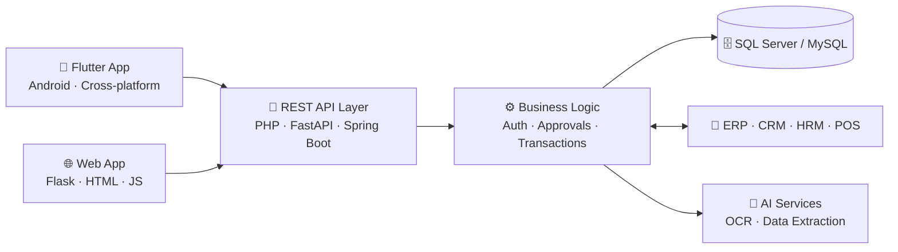

<!--
  GitHub Profile README
  Publish as README.md in a PUBLIC repo named exactly like your username: github.com/ayonfardous/ayonfardous
-->

<div align="center">


<br/>

[](https://www.linkedin.com/in/ayon-fardous/)
[](https://github.com/ayonfardous?tab=followers)
[](https://github.com/ayonfardous)

<!--
  Optional badges - fill in and uncomment:
  [](mailto:YOUR_EMAIL)
  [](https://YOUR_PORTFOLIO_URL)
-->

</div>

---

## 👋 About Me

I'm **Md. Ayon Fardous**, a Software Engineer who builds practical, scalable, business-oriented software. I like working where **mobile apps, backend APIs, databases, and real business processes come together as one complete system** — POS and billing, approvals, inventory, and enterprise transactions.

| | |
|:--|:--|
| 💼 **Now** | Junior Software Engineer at **United Group (Orange Solutions Limited)** — Dhaka, Bangladesh |
| 🎓 **Studying** | M.Sc. in Information Technology at **Jahangirnagar University** |
| ⚙️ **Focus** | Flutter apps · REST APIs · ERP / database integration |
| 🤖 **Exploring** | AI-assisted document extraction, OCR, and business automation |
| 🤝 **Open to** | Collaboration on Flutter, backend/API, and automation projects |

---

## 🚀 What I Build

| Domain | What I do |
|:--|:--|
| 📱 **Mobile** | Cross-platform apps with **Flutter & Dart** — REST API integration, POS/billing screens, receipt printing, large-screen layouts |
| 🌐 **Web & APIs** | REST APIs and web apps with **PHP, Python (FastAPI / Flask), and Java / Spring Boot** |
| 🏢 **Enterprise** | **ERP, CRM, HRM, and POS** integration — inventory, approvals, and transaction workflows |
| 🗄️ **Data** | **SQL Server & MySQL** — stored procedures, complex queries, data synchronization |
| 🤖 **AI & Automation** | Document understanding, OCR, structured data extraction, API-based AI integration |

### 🧩 How the pieces fit together



---

## 🛠️ Tech Stack

| Category | Technologies |
|:--|:--|
| **Mobile** |  |
| **Backend & Web** |  |
| **Databases** |   |
| **Tools** |  |

---

## 📌 Featured Projects

| Project | What it does | Built with |
|:--|:--|:--|
| **CV AI Extractor** | Upload CVs, extract structured data with AI, verify the results, and search a CV bank | Python · Flask · Jinja2 · Tailwind CSS |
| **Flutter POS & Billing App** | Item-grid POS with bill/receipt printing and a large-screen (TV) layout | Flutter · Dart |
| **ERP-Connected Business Apps** | Mobile and web clients over REST APIs for approvals, inventory, and transactions | Flutter · REST APIs · SQL Server / MySQL |

<!--
  Link each project to its public repo, for example:
  | **[CV AI Extractor](https://github.com/ayonfardous/REPO_NAME)** | ... | ... |
  Remove any row for work that belongs to your company.
-->

---

## 🧭 Experience & Education

**Junior Software Engineer** · United Group (Orange Solutions Limited) · Dhaka, Bangladesh · *Apr 2025 – Present*

- Build Flutter mobile apps and web applications integrated with ERP and business systems
- Develop REST APIs and SQL Server / MySQL logic behind POS, billing, approval, and transaction workflows
- Work on AI-assisted document extraction and business-process automation

**Education**

- 🎓 **M.Sc. in Information Technology** — Jahangirnagar University · *Dec 2025 – Present*
- 🎓 **B.Sc. in Computer Science & Engineering** — Bangladesh University of Business and Technology (BUBT) · *2020 – 2024*

---

## 📊 GitHub Activity

<div align="center">

<picture>
  <source media="(prefers-color-scheme: dark)" srcset="https://github-readme-stats.vercel.app/api?username=ayonfardous&show_icons=true&hide_border=true&count_private=true&theme=tokyonight">
  
</picture>
<picture>
  <source media="(prefers-color-scheme: dark)" srcset="https://github-readme-stats.vercel.app/api/top-langs/?username=ayonfardous&layout=compact&langs_count=8&hide_border=true&theme=tokyonight">
  
</picture>

<picture>
  <source media="(prefers-color-scheme: dark)" srcset="https://streak-stats.demolab.com/?user=ayonfardous&hide_border=true&theme=tokyonight">
  
</picture>

</div>

---

<details>
<summary><b>🔍 Detailed expertise breakdown</b></summary>

<br/>

```text
Mobile Application Development
├── Flutter
├── Dart
├── Android
└── REST API Integration

Backend Development
├── PHP
├── REST APIs
├── Java / Spring Boot
├── Python / FastAPI / Flask
└── Authentication & Business Logic

Enterprise Systems
├── ERP Integration
├── POS Systems
├── CRM
├── HRM
├── Inventory
├── Approval Workflows
└── Business Process Automation

Database
├── Microsoft SQL Server
├── MySQL
├── Stored Procedures
├── Complex Queries
└── Data Synchronization

AI & Automation
├── Document Understanding
├── OCR
├── Structured Data Extraction
├── AI-assisted Business Automation
└── API-based AI Integration

Tools
└── Git · GitHub · Postman · VS Code · IntelliJ IDEA
```

</details>

---

## 🤝 Let's Connect

I'm always happy to talk about Flutter, ERP-integrated systems, backend APIs, and AI-powered automation — reach out on [LinkedIn](https://www.linkedin.com/in/ayon-fardous/).

<div align="center">

⭐ Thanks for stopping by!


</div>
