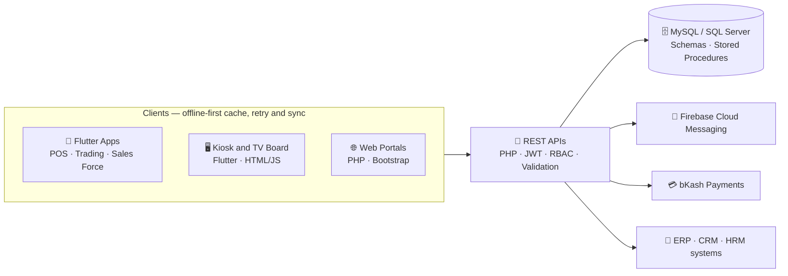

<!--
  GitHub Profile README
  Publish as README.md in a PUBLIC repo named exactly like your username: github.com/ayonfardous/ayonfardous
-->

<div align="center">


<br/>

[](https://www.linkedin.com/in/ayon-fardous/)
[](mailto:ayonfardous.ion@gmail.com)
[](https://github.com/ayonfardous?tab=followers)
[](https://github.com/ayonfardous)

<!--
  Optional portfolio badge - fill in and uncomment:
  [](https://YOUR_PORTFOLIO_URL)
-->

</div>

---

## 👋 About Me

I'm **Md. Ayon Fardous**, a Software Engineer with 1+ year of professional experience delivering **production-grade mobile, kiosk, and web applications** across point-of-sale, restaurant operations, queue management, stock trading, field sales, incentive management, and supply-chain workflows.

I've built and supported **seven production applications** with Flutter, Dart, PHP, MySQL, and Microsoft SQL Server, and I own features end to end — REST APIs, database design, role-based access control, and production support.

| | |
|:--|:--|
| 💼 **Now** | Junior Software Engineer at **Orange Solutions Limited (United Group)** — Dhaka, Bangladesh |
| 🎓 **Studying** | M.Sc. in Information Technology at **Jahangirnagar University** |
| ⚙️ **Focus** | Flutter apps · PHP REST APIs · SQL Server / MySQL · offline-first architecture |
| 🌱 **Learning** | DevOps · AI agents · AI-assisted document extraction & OCR |
| 🤝 **Open to** | Collaboration on Flutter, backend/API, and automation projects |

<div align="center">

### 📈 By the numbers

| **7** | **30–50%** | **15+** | **1+ yr** |
|:-:|:-:|:-:|:-:|
| production apps built & supported | improvement in load times & transaction reliability | screens shipped in a stock trading app | professional experience |

</div>

---

## 🚀 What I Build

| Domain | What I do |
|:--|:--|
| 📱 **Mobile & Kiosk** | **Flutter & Dart** apps for Android and iOS and self-service kiosks — POS, trading, field sales; Play Store & App Store publishing; thermal-printer, GPS, and push-notification integrations |
| 🌐 **Backend & APIs** | **PHP REST APIs** with JWT auth, token refresh, request validation, pagination, and role-based access control (plus Python / FastAPI / Flask and Java / Spring Boot) |
| 🗄️ **Data** | **MySQL & SQL Server** — schema design, stored procedures, indexing, query optimization, data synchronization |
| 🔁 **Reliability** | Offline-first caching, exponential-backoff retries, idempotent payments, conflict-aware sync |
| 🏢 **Business Systems** | POS, ERP, CRM, and HRM workflows — inventory, approvals, payments, and audit trails |
| 🤖 **AI & Automation** | Document understanding, OCR, structured data extraction, and computer-vision transfer learning |

### 🧩 How the pieces fit together



---

## 🛠️ Tech Stack

| Category | Technologies |
|:--|:--|
| **Mobile** |  |
| **Backend & Web** |  |
| **Databases** |   |
| **Cloud & Tools** |  |
| **AI / ML** |  |
| **Engineering** | OOP · Offline-first architecture · Data synchronization · Conflict resolution · API integration · Unit & integration testing · CI/CD |

---

## 📌 Featured Projects

Delivered at **Orange Solutions Limited (United Group)**:

| Project | What I delivered | Stack |
|:--|:--|:--|
| **UniDash Smart Ecosystem**<br/>*2026* | Full-stack multi-brand restaurant **Mobile POS** (cart, discounts, tax, payments, receipts, permissions, reporting), a live **TV order board / kitchen display**, and a **self-service kiosk** with payment verification, invoicing, and thermal printing | Flutter · PHP · MySQL · SQL Server · JS |
| **Queue Management System**<br/>*2026* | Rebuilt the Flutter app with **push notifications** and real-time queue status so customers can track their place remotely | Flutter · PHP · MySQL · FCM |
| **Board of Trade Stock Trading App**<br/>*2025* | Owned UI/UX and Flutter build of **15+ production screens** — portfolios, watchlists, order placement, candlestick and market-depth charts, live trade feed — with **40–50% faster** screen loads | Flutter · Dart · REST APIs · SQL Server |
| **Mobile POS — Parking & Restaurant**<br/>*2025* | Designed the schema, PHP APIs, and Flutter workflows for table selection, split payments, taxes, and Bluetooth receipts; **30–40% fewer failed transaction screens**, **25% faster** receipt loading | Flutter · Dart · PHP · MySQL |
| **Sales Force Mobile App**<br/>*2025* | GPS check-ins, route history, orders, and deposit collection with **multi-level role-based access** and an **offline write queue** with conflict-aware sync | Flutter · PHP · SQL Server · GPS |
| **Supply Portal Management System**<br/>*2025* | Three-stage **Outlet → Procurement → Accounts** web portal with approvals, payment confirmation, audit history, and status dashboards | PHP · MySQL · Bootstrap · JS |
| **MIP Dealer Incentive Program**<br/>*2025* | QR-based dealer verification and **tokenized bKash payments** with idempotency checks, batching, and audit logging to prevent duplicate disbursements | Flutter · PHP · SQL Server · bKash API |

### 🤖 AI & Research

| Project | Highlights | Stack |
|:--|:--|:--|
| **Driver Behavior Recognition**<br/>*2024 · BUBT capstone* | Classifies dangerous driving from dashboard-camera images using MobileNet transfer learning, augmentation, and per-class precision / recall / F1 evaluation | Python · TensorFlow · Keras · MobileNet |
| **CV AI Extractor** | Upload CVs, extract structured data with AI, verify the results, and search a CV bank | Python · Flask · Jinja2 · Tailwind CSS |

<!--
  Link a project to its public repo, for example:
  | **[CV AI Extractor](https://github.com/ayonfardous/REPO_NAME)** | ... | ... |
  Remove any row you're not able to publish.
-->

---

## 🧭 Experience & Education

**Junior Software Engineer** · Orange Solutions Limited, United Group · Dhaka, Bangladesh · *Apr 2025 – Present*

- Delivered **seven production applications** — POS, self-service kiosk, queue management, stock trading, field sales, dealer incentives, and supply chain — with Flutter interfaces, PHP REST APIs, and MySQL / SQL Server components
- Improved load times and transaction reliability by **30–50%** through local caching, lazy-loaded pagination, exponential-backoff retries, offline processing, and conflict-aware synchronization
- Turned operational requirements into responsive mobile interfaces, validated API endpoints, relational schemas, stored procedures, and role-based business workflows
- Diagnosed API, database, printing, synchronization, payment, and transaction-processing defects across mobile, kiosk, and web environments

**Intern Software Engineer** · United Group · Dhaka, Bangladesh · *Jan 2025 – Mar 2025*

- Implemented UI components, integrated REST APIs, resolved defects, and contributed to unit and integration testing in an Agile team

**Education**

- 🎓 **M.Sc. in Information Technology** — Jahangirnagar University · *Dec 2025 – Present*
- 🎓 **B.Sc. in Computer Science & Engineering** — Bangladesh University of Business and Technology (BUBT) · *Feb 2020 – Jun 2024*

---

## 🏅 Certifications & Training

| Course | Provider | When |
|:--|:--|:--|
| Mastering DevOps: From Fundamentals to Advanced Practices | Ostad | *In progress* |
| AI Agents Intensive Course | Google | Dec 2025 |
| Mobile Application Development with Flutter | EDGE Project | May 2025 |
| Introduction to Mobile Application Development with Flutter | Alison | Sep 2024 |
| Tech Launchpad: Python, Networking, Cloud, and AWS | Craftsmen | Nov 2023 |

---

## 📊 GitHub Activity

<div align="center">

<picture>
  <source media="(prefers-color-scheme: dark)" srcset="https://github-readme-stats.vercel.app/api?username=ayonfardous&show_icons=true&hide_border=true&count_private=true&theme=tokyonight">
  
</picture>
<picture>
  <source media="(prefers-color-scheme: dark)" srcset="https://github-readme-stats.vercel.app/api/top-langs/?username=ayonfardous&layout=compact&langs_count=8&hide_border=true&theme=tokyonight">
  
</picture>

<picture>
  <source media="(prefers-color-scheme: dark)" srcset="https://streak-stats.demolab.com/?user=ayonfardous&hide_border=true&theme=tokyonight">
  
</picture>

</div>

---

<details>
<summary><b>🔍 Detailed expertise breakdown</b></summary>

<br/>

```text
Programming Languages
└── Dart · PHP · JavaScript · Python · SQL · HTML · CSS

Mobile & Frontend Development
├── Flutter
├── Android / iOS
├── Responsive UI development
├── State management
└── Application publishing (Play Store · App Store)

Backend & API Development
├── RESTful APIs · JSON
├── JWT authentication · token refresh
├── Request validation · pagination · retry handling
├── Role-based access control
└── Java / Spring Boot · Python / FastAPI · Flask

Databases
├── MySQL
├── Microsoft SQL Server
├── Schema design
├── Stored procedures · joins · indexing
└── Query optimization

Enterprise Systems
├── ERP Integration
├── POS · CRM · HRM
├── Inventory
├── Approval Workflows
└── Business Process Automation

Cloud & Development Tools
├── Firebase Authentication · Firebase Cloud Messaging
├── Git · GitHub · CI/CD
└── Postman · Android Studio · Visual Studio Code

Engineering Concepts
├── Object-oriented programming
├── Offline-first architecture
├── Data synchronization · conflict resolution
├── API integration · debugging
└── Unit testing · integration testing

AI & Automation
├── Document Understanding · OCR
├── Structured Data Extraction
├── AI-assisted Business Automation
└── Computer Vision (MobileNet transfer learning)
```

</details>

---

## 🤝 Let's Connect

I'm always happy to talk about Flutter, backend APIs, offline-first mobile architecture, and AI-powered automation — reach out on [LinkedIn](https://www.linkedin.com/in/ayon-fardous/) or [email](mailto:ayonfardous.ion@gmail.com).

<div align="center">

⭐ Thanks for stopping by!


</div>
